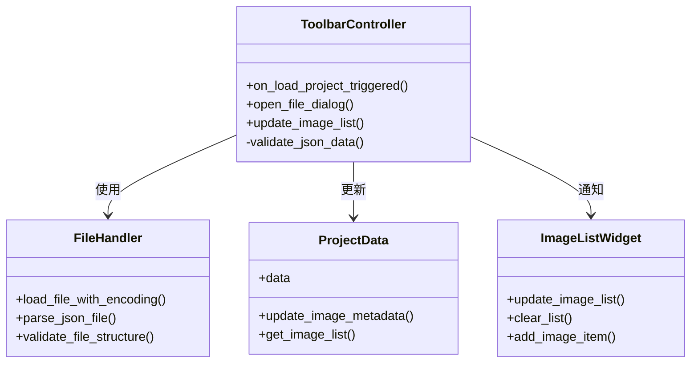
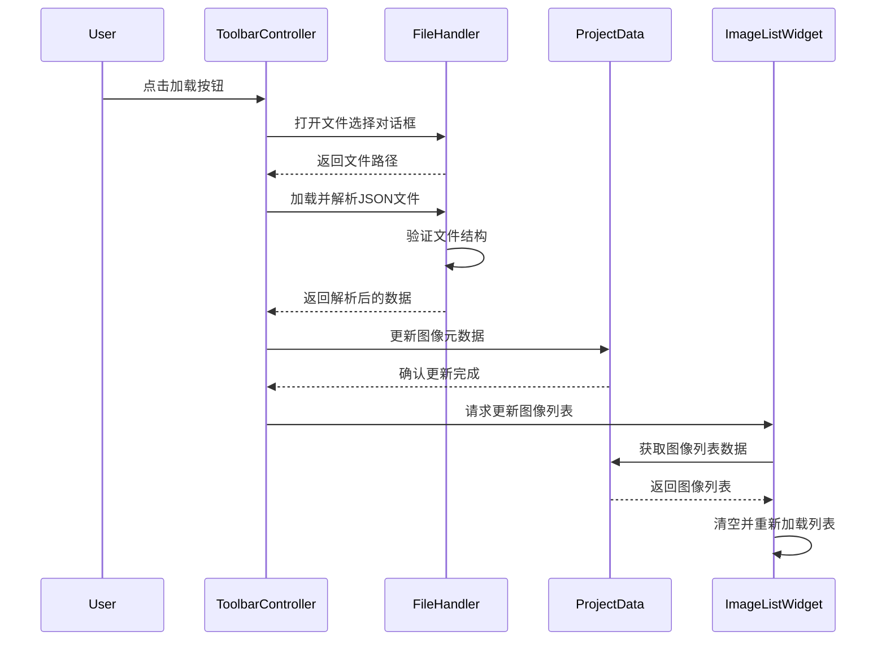

# 现代化软件架构建议

## 1. 技术栈选择
- 编程语言：Python 3.10+
- 界面框架：PyQt6
- 日志系统：logging模块
- 配置管理：YAML
- 测试框架：pytest
- 代码质量：flake8, black
- 文档生成：Sphinx

## 2. 开发环境配置
- Python虚拟环境：venv
- 依赖管理：requirements.txt
- IDE配置：VSCode
  - 代码格式化：black
  - 代码检查：flake8
  - 单元测试：pytest
- 版本控制：Git
  - 分支策略：Git Flow
  - 提交规范：Conventional Commits

## 3. 基于当前目录的架构设计
### 3.1 目录结构
```
project/
├── src/                  # 源代码
│   ├── controllers/      # 控制器层
│   ├── core/             # 核心业务逻辑
│   ├── services/         # 服务层
│   ├── ui/               # 用户界面
│   └── utils/            # 工具类
├── config/               # 配置文件
├── docs/                 # 项目文档
├── logs/                 # 日志文件
├── assets/               # 静态资源
├── scripts/              # 脚本文件
└── requirements.txt      # 依赖文件
```

### 3.2 分层架构及功能
#### 表现层（src/ui/）
- 图像显示组件
- 标注工具界面
- 工具栏和菜单
- 状态显示
- 快捷键处理
- 用户交互反馈

#### 控制器层（src/controllers/）
- 用户操作处理
- 界面事件分发
- 业务逻辑调用
- 状态管理
- 快捷键绑定
- 界面更新控制
- 数据加载与同步
  - 处理文件加载操作
  - 验证数据格式
  - 更新项目数据
  - 同步UI组件状态

#### 业务逻辑层（src/core/）
- 标注数据管理
- VIA格式兼容处理
- 图像处理逻辑
- 标注规则验证
- 数据转换处理
- 核心算法实现

#### 服务层（src/services/）
- 文件读写服务
- 外部API调用
- 数据存储服务
- 配置管理服务
- 日志记录服务
- 插件扩展支持

#### 工具类（src/utils/）
- 通用工具函数
- 图像处理工具
- 数据格式转换
- 字符串处理
- 日期时间处理
- 文件操作工具

## 4. 测试策略
```
tests/
├── unit/                 # 单元测试
│   ├── controllers/      # 控制器测试
│   ├── core/             # 核心逻辑测试
│   ├── services/         # 服务测试
│   └── utils/            # 工具类测试
├── integration/          # 集成测试
└── e2e/                  # 端到端测试
```

## 5. 持续集成/部署
- CI/CD工具：GitHub Actions
- 自动化流程：
  - 代码检查
  - 单元测试
  - 集成测试
  - 文档生成
  - 打包发布

## 6. 文档规范
- API文档：Sphinx + autodoc
- 架构文档：Markdown
- 开发指南：Markdown
- 变更日志：CHANGELOG.md

## 7. 完整数据流规划

### 7.1 组件职责


### 7.2 详细数据流


### 7.3 代码组织规范
1. **ToolbarController**
   - 处理所有工具栏相关事件
   - 协调文件加载和UI更新
   - 实现数据验证逻辑

2. **FileHandler**
   - 负责文件读写操作
   - 实现JSON解析和验证
   - 处理文件编码问题

3. **ProjectData**
   - 集中管理项目数据
   - 提供数据访问接口
   - 维护数据一致性

4. **ImageListWidget**
   - 专注于图像列表显示
   - 实现列表更新逻辑
   - 处理用户交互事件

### 7.4 接口定义
```python
# FileHandler接口
def load_file_with_encoding(file_path: str) -> dict:
    """加载并解析文件，返回结构化数据"""
    
def validate_file_structure(data: dict) -> bool:
    """验证文件结构是否符合预期"""

# ProjectData接口
def update_image_metadata(data: dict) -> None:
    """更新图像元数据"""
    
def get_image_list() -> list[dict]:
    """获取图像列表数据"""

# ImageListWidget接口
def update_image_list() -> None:
    """更新图像列表显示"""
```

### 7.5 错误处理策略
1. 文件加载失败
   - 记录错误日志
   - 显示用户友好提示
   - 恢复初始状态

2. 数据验证失败
   - 记录验证错误详情
   - 提示用户文件格式问题
   - 提供修复建议

3. UI更新失败
   - 记录UI错误
   - 回滚数据更改
   - 显示错误状态

## 8. 错误处理机制
- 统一异常处理
- 错误日志记录
- 用户友好提示
- 错误恢复机制

## 8. 性能优化考虑
- 异步编程
- 缓存机制
- 延迟加载
- 资源管理

## 9. 安全策略
- 输入验证
- 权限控制
- 日志脱敏
- 配置加密
